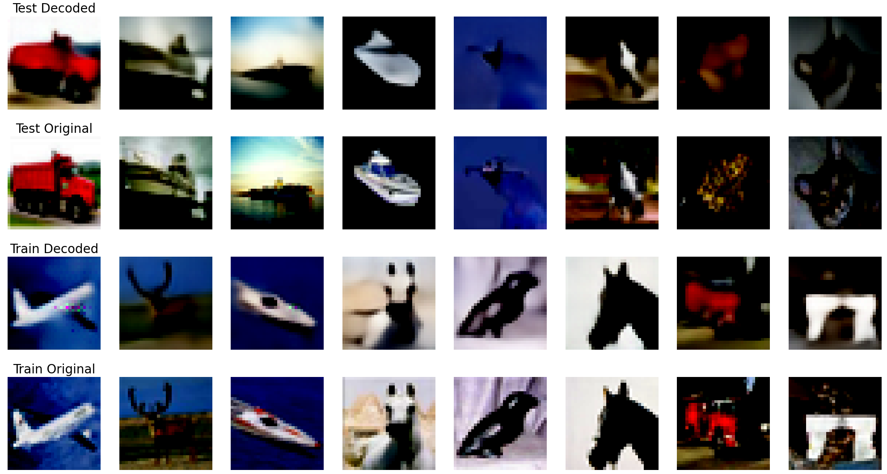
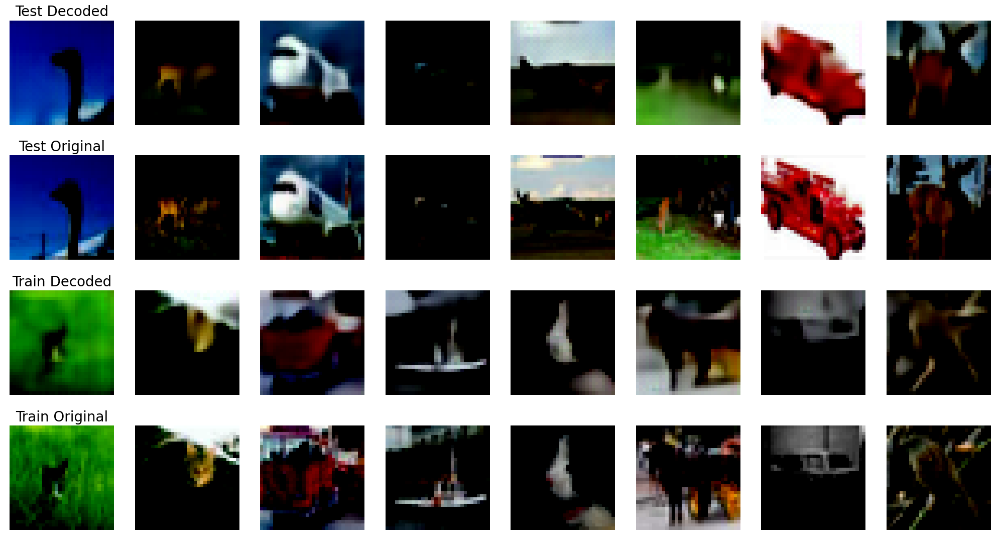

# Taming Transformers for High-Resolution Image Synthesis

### Introduction
Implementation of the paper "Taming Transformers for High-Resolution Image Synthesis". This repository only contains the code for the reconstruction experiments. Trained on the CIFAR-10 dataset.

The current code supports single-machine multi-GPU training. It utilizes the Distributed Data Parallel (DDP) mechanism of the PyTorch Lightning framework to achieve multi-GPU parallel computing and accelerate the model training process.




<center>trained on NVIDIA GeForce RTX 3080 Laptop GPU</center>


<center>trained on 8 * NVIDIA GeForce RTX 2080 Ti</center>

### Parameter Settings
Training configurations can be adjusted through command-line parameters. Here are the descriptions of some main parameters:

+ `--latent_dim`: The size of the latent dimension, with a default value of 64.
+ `--code_dim`: The size of the code dimension, with a default value of 64.
+ `--num_codebook_vectors`: The number of codebook vectors, with a default value of 1024.
+ `--channels`: The number of channels in each layer of the model, with a default of [128, 128, 256, 256].
+ `--resolution`: A parameter related to the input image resolution, with a default of 64.
+ `--latent_size`: A parameter related to the size of the latent space, with a default of 16.
+ `--image_size`: The size of the input image, with a default of 64.
+ `--image_channels`: The number of image channels, with a default of 3.
+ `--beta`: A coefficient related to a specific loss term, with a default of 0.25.
+ `--device`: The specified device, with a default of 'cuda', which means using the GPU for computation (if available).
+ `--batch_size`: The training batch size, with a default of 32.
+ `--epochs`: The number of training epochs, with a default of 100.
+ `--learning_rate`: The learning rate, with a default of 1e-3.
+ `--beta1`, `--beta2`: Parameters related to the optimizer, with defaults of 0.5 and 0.9 respectively.
+ `--disc_start`: A parameter related to the step at which the discriminator starts participating in training, with a default of 600.
+ `--Milestones`: Milestone steps for learning rate adjustment, with a default of [20, 50, 80].
+ `--disc_factor`: The discriminator-related loss factor, with a default of 0.1.
+ `--rec_loss_factor`: The reconstruction loss factor, with a default of 1.
+ `--perceptual_loss_factor`: The perceptual loss factor, with a default of 0.1.
+ `--path`: The path to the dataset, with a default of /mnt/Datasets/CIFAR10.

### Start Training
you can start training by running the following command:
```bash
python -u train.py --path yourpath
```
or run the following command to train the model with multi-GPU:
```bash
python -u train_light.py --path yourpath
```

### Test Your Model

You can test your model by running the following command:
```bash
python -u test.py --path yourpath
```
If you want to test the model which trained on multi-GPU, you should run the following command:
```bash
python -u test_light.py --path your_path --ckpt_path your_ckpt_path
```
